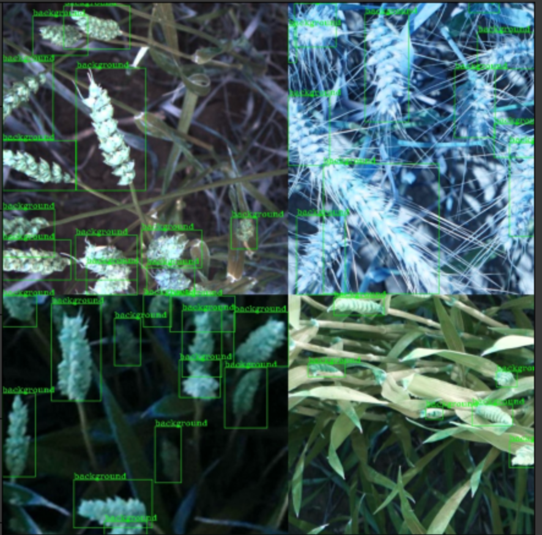

# MMdetection v2 with mosaic data augmentation

## Introduction
Support SOTA model DetectoRS  
Please check configs/detectors/detectors_cascade_rcnn_r50_1x_coco.py/train_pipeline  
Please check mmdet/datasets/mosaic.py mosaiccoco.py my_mosaic.py  
Please check mmdet/datasets/pipelines/loading  
[Colab Training Notebook](MMDetection_DetectoRS_training_backbone_resnet50_ft.ipynb)
  
## Useage
Replace LoadImageFromFile and LoadAnnotations with LoadMosaicImageAndAnnotations in train_pipeline

# Reference 
### mmdetection
https://github.com/open-mmlab/mmdetection
### DetectoRS
https://github.com/joe-siyuan-qiao/DetectoRS
### Mosaic data augmentation
https://github.com/ultralytics/yolov5
